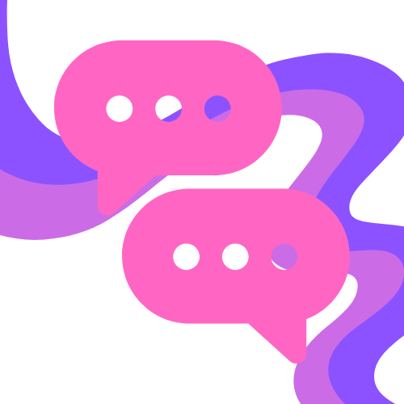

<p align="center">
  
</p>

<h1 align="center">Verbatim</h1>

<p align="center">
  A cross-platform server-side chat channel system with configurable channels, direct messaging, distance-based local chat, offline mail, and Discord integration.
</p>

<p align="center">
  <a href="USAGE.md">Usage Guide</a>
</p>

## Supported Platforms

| Platform | Directory | Build Output | Notes |
|----------|-----------|-------------|-------|
| **Paper / Spigot** (1.21.4) | `paper/` | Shadow JAR | Full feature support via Adventure API |
| **NeoForge** (Minecraft 1.21.1) | `neoforge/` | JarJar mod JAR | Full feature support via Minecraft `Style` |
| **Forge** (Minecraft 1.20.1) | `forge/` | Shadow JAR (`-all`) | Full feature support via Minecraft `Style` |
| **Hytale** | `hytale/` | Shadow JAR | Limited: no hover/click events, no underline/strikethrough/obfuscated |

All platforms share identical business logic from `core/`. Platform modules only contain adapter code.

## Architecture

Verbatim uses a service locator with adapter pattern. All shared logic lives in `core/` and depends on platform-independent interfaces. Platform entry points wire concrete implementations at startup via `Verbatim.java`.

### Core Interfaces (`core/context/`)

| Interface | Purpose |
|-----------|---------|
| `GameContext` | Server operations, player retrieval, messaging, persistent data, permissions |
| `GamePlayer` | Player abstraction (username, display name, UUID) |
| `GameComponent` | Styled text with color, bold, italic, underline, click/hover events |
| `GameCommandSource` | Command executor with permission checks |
| `ChatFormatter` | Color code parsing (`&X`, `&#RRGGBB`), player name formatting, link detection |
| `GameConfig` | Configuration access (channels, Discord, join/leave messages) |

### Shared Business Logic (`core/`)

| Class | Purpose |
|-------|---------|
| `ChatEventHandler` | Routes chat/login/logout events to channels, DMs, and Discord |
| `ChatChannelManager` | Channel membership, focus management, persistent state |
| `VerbatimCommandHandlers` | All command implementations (`/channel`, `/msg`, `/nick`, `/mail`, etc.) |
| `MailService` | Offline mail storage and delivery |
| `DiscordBot` / `DiscordListener` | JDA-based Discord bridge |
| `PermissionService` | LuckPerms -> native permissions -> permission level fallback |
| `PrefixService` | Player prefix/group data from LuckPerms |

## Hytale Platform Limitations

| Feature | Paper / NeoForge | Hytale |
|---------|-----------------|--------|
| Hover tooltips | Full support | Not available |
| Click: suggest command | Full support | Not available |
| Underline, strikethrough, obfuscated | Full support | Not available |

## Building

Each module is an independent Gradle project. Build from within each directory:

```bash
cd core && ./gradlew build       # Shared logic + tests
cd paper && ./gradlew build      # Paper plugin (shadow JAR)
cd neoforge && ./gradlew build   # NeoForge mod (JarJar)
cd forge && ./gradlew build      # Forge mod (shadow JAR)
cd hytale && ./gradlew build     # Hytale plugin (shadow JAR)
```

Hytale requires `hytale_server_jar` set in `hytale/gradle.properties`.
Forge requires Java 17; on NixOS set `org.gradle.java.installations.paths` in `~/.gradle/gradle.properties`.
